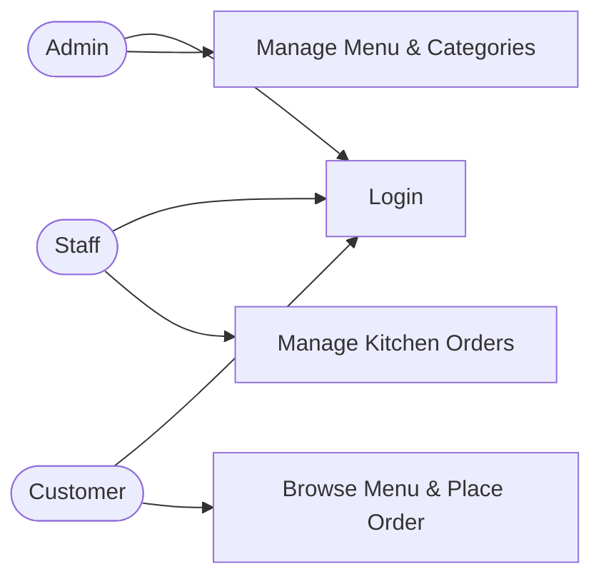

# Mini Project Journal

- **Student Name: Nigel Ng Yi Shun**
- **Project Title: MentaiYa - Online Ordering & POS System**
- **Start Date: 2026-09-28**
- **End Date: 2026-10-11**

---

## Project Overview

> Briefly describe your project idea, what problem it solves, and what you aim to build.

A web-based ordering and POS system for a Japanese restaurant called MentaiYa. It handles customer online orders, kitchen order tracking, menu item updates, and multi-role user access (Admin, Staff, Customer).

---

## Tech Stack

> List the technologies, frameworks, and tools you plan to use.

- **Frontend: HTML, CSS**
- **Backend: PHP**
- **Database: MySQL**
- **Other: VS Code, XAMPP**

---

## Day 1 — Date: 2026-09-28

### What I planned to do today
Design database schema and setup project environment.

### What I actually did
Created database tables for users, categories, menu items, and orders in MySQL.

### Blockers / Challenges
Configuring foreign key constraints for menu items and orders.

### What I learned
How to use PDO with exception handling in PHP.

---

## Day 2 — Date: 2026-09-29

### What I planned to do today
Insert seed data into database.

### What I actually did
Added default users (Admin/Staff) and initial menu categories with items.

### Blockers / Challenges
Encrypting default passwords properly using `password_hash`.

### What I learned
Using `CHECK` constraints to restrict roles and order status in MySQL.

---

## Day 3 — Date: 2026-09-30

### What I planned to do today
Build database connection file.

### What I actually did
Wrote `database.php` using PDO with host, dbname, and fetch mode settings.

### Blockers / Challenges
Handling connection failure errors gracefully.

### What I learned
Setting default fetch mode to `FETCH_ASSOC` in PDO.

---

## Day 4 — Date: 2026-10-01

### What I planned to do today
Implement session authentication functions.

### What I actually did
Created `roles.php` with `isAdmin()`, `isStaff()`, `isCustomer()`, and `isUser()` helpers.

### Blockers / Challenges
Validating nested `$_SESSION` array variables cleanly.

### What I learned
Managing role-based access control with PHP sessions.

---

## Day 5 — Date: 2026-10-02

### What I planned to do today
Build user registration page.

### What I actually did
Created `register.php` with form validation and password hashing.

### Blockers / Challenges
Preventing duplicate usernames during registration.

### What I learned
Checking existing usernames before executing `INSERT` query.

---

## Day 6 — Date: 2026-10-03

### What I planned to do today
Build login and logout pages.

### What I actually did
Implemented `login.php` using `password_verify()` and built `logout.php` to destroy sessions.

### Blockers / Challenges
Redirecting users correctly based on their role after login.

### What I learned
Using `session_destroy()` and redirecting with `header()`.

---

### What I planned to do today
Create main CSS stylesheet.

### What I actually did
Wrote styles for card layouts, buttons, tables, and responsive forms.

### Blockers / Challenges
Styling form elements to look consistent across browsers.

### What I learned
Using CSS custom variables for theme colors.

---

## Day 8 — Date: 2026-10-05

### What I planned to do today
Build customer ordering page UI.

### What I actually did
Designed `customer.php` sidebar, category links, and dish cards.

### Blockers / Challenges
Handling layout issues in the food grid.

### What I learned
Using CSS Grid for dynamic menu item displays.

---

## Day 9 — Date: 2026-10-06

### What I planned to do today
Implement customer ordering functionality.

### What I actually did
Added category filtering and table number selection for submitting orders.

### Blockers / Challenges
Passing selected category via GET request while posting order forms.

### What I learned
Combining GET parameter filters with POST form submissions.

---

## Day 10 — Date: 2026-10-07

### What I planned to do today
Add order history view for customers.

### What I actually did
Fetched logged-in user orders from database and rendered them in a table.

### Blockers / Challenges
Joining `orders` and `menu_items` tables to display dish names.

### What I learned
Writing SQL `JOIN` queries to combine data across tables.

---

## Day 11 — Date: 2026-10-08

### What I planned to do today
Build kitchen display system for staff.

### What I actually did
Created `staff.php` to list incoming orders sorted by creation time.

### Blockers / Challenges
Filtering staff access using `isStaff()` middleware.

### What I learned
Updating order status from `Pending` to `Completed` using SQL updates.

---

## Day 12 — Date: 2026-10-09

### What I planned to do today
Build admin dashboard categories and dish management.

### What I actually did
Added form controls in `admin.php` to insert categories and new menu items.

### Blockers / Challenges
Deleting categories without breaking referenced menu items.

### What I learned
Using `ON DELETE CASCADE` in database table setup.

---

## Day 13 — Date: 2026-10-10

### What I planned to do today
Complete admin inline editing and order controls.

### What I actually did
Added inline editing for menu prices and delete functions for dishes/orders.

### Blockers / Challenges
Handling multiple forms and action types on a single PHP page.

### What I learned
Checking `isset($_POST['action_name'])` to route form processing.

---

### What I planned to do today
Test end-to-end user workflows and fix bugs.

### What I actually did
Tested full flow from customer ordering to kitchen update and admin management.

### Blockers / Challenges
Ensuring session checks protected all restricted pages properly.

### What I learned
Systematic end-to-end testing of web applications.

---

## Final Reflection

### What went well?
All customer, staff, and admin modules were built and connected smoothly with PDO.

### What would I do differently?
Add AJAX requests for real-time order status updates without page reloads.

### Key takeaways from this project
Gained practical experience with PHP sessions, MySQL PDO operations, and role-based access control.


---


# Project Proposal: PHP + MySQL Application

> **Course:** J620-002-4:2020 Front-End Software Development (Level 4)
> **Competency Unit:** J620-002-4:2020-C01
> **Instructions:** Replace every `[ ... ]` and delete the hint lines (starting with `>`) before submitting. Keep this file as `README.md` in the root of your project repository.

---

## 1. Student Details

| Field | Your Answer |
|---|---|
| Candidate Name | [ Nigel Ng Yi Shun ] |
| NRIC Number | [ 070420070317 ] |
| Date Submitted | [ ... ] |

---

## 2. Project Title

**[ MentaiYa - Smart Restaurant Ordering & Kitchen Management System ]**

### One-line summary
[ A web application for customers to browse menu and order food, kitchen staff to view orders, and admin to manage the menu. ]

---

## 3. Problem Statement & Purpose

> What problem does your application solve? Who is it for? Why is it useful?

[ Manual paper ordering in small restaurants causes miscommunication between servers and the kitchen. MentaiYa provides a digitized ordering platform to simplify menu browsing, food ordering, and kitchen status tracking. ]

---

## 4. Tech Stack

> Required: HTML, CSS, PHP, MySQL.

| Layer | Technology |
|---|---|
| Markup | HTML5 |
| Styling | CSS3 |
| Server-side | PHP |
| Database | MySQL |

---

## 5. Types of Users (Roles)

> Minimum **3 roles**. Each role must have different levels of access.

| Role | Description |
|---|---|
| Admin | Manages menu items, categories, and user accounts. |
| Staff | Views pending food orders and updates order preparation status. |
| Customer | Browses the menu, places food orders, and tracks order status. |

### Role-Based Access Matrix

> Mark what each role can do. Add or remove rows to match your features.

| Feature / Page | Role 1 | Role 2 | Role 3 | Guest (not logged in) |
|---|:---:|:---:|:---:|:---:|
| Register / Login | ✅ | ✅ | ✅ | ✅ |
| View Menu | ✅ | ✅ | ✅ | ✅ |
| Place Food Order | ❌ | ❌ | ✅ | ❌ |
| Manage Kitchen Orders | ❌ | ✅ | ❌ | ❌ |
| Manage Menu & Categories | ✅ | ❌ | ❌ | ❌ |

---

## 6. Features

### 6.1 Core Features (must have)

- [x] User registration and login
- [x] Role-based access control (each role sees/does different things)
- [x] Data management (Create, Read, Update, Delete)
- [x] Food ordering system for customers
- [x] Kitchen order status management for staff

### 6.2 Extra Features (nice to have)

- [x] Table number selection during checkout
- [ ] Real-time total price calculation in cart

### 6.3 Feature Descriptions

> Briefly explain each core feature: what it does and which role uses it.

| Feature | Description | Role(s) |
|---|---|---|
| User Authentication | Allows users to log in securely with PHP session-based access control. | All Roles |
| Menu Management | Admin can Create, Read, Update, and Delete food items and categories. | Admin |
| Order Placement | Customers select items and submit food orders. | Customer |
| Order Processing | Staff view orders and change status from 'Pending' to 'Completed'. | Staff |


---

## 7. Data Management System

> Which data can users create, view, edit and delete? Who is allowed to do what?

| Data / Entity | Create | Read | Update | Delete |
|---|---|---|---|---|
| Users | Admin, Guest | Admin | Admin | Admin |
| Categories | Admin | All Roles | Admin | Admin |
| Menu Items | Admin | All Roles | Admin | Admin |
| Orders | Customer | Admin, Staff, Customer | Staff | Admin |

---

## 8. Database Design

> Minimum **4 tables** with at least **3 linkages** (foreign keys) between them.

### Entity Relationship Diagram (ERD)

> Create your own ERD for your database and place it here. You can draw it in draw.io or dbdiagram.io and insert the exported image (e.g. ``), or write it in Mermaid.

[```mermaid
erDiagram
    categories ||--o{ menu_items : "has"
    users ||--o{ orders : "places"
    menu_items ||--o{ orders : "ordered"

    users {
        int id PK
        string username
        string email
        string password
        enum role "Admin, Staff, Customer"
        timestamp created_at
    }

    categories {
        int category_id PK
        string category_name
    }

    menu_items {
        int item_id PK
        int category_id FK
        string item_name
        decimal price
        string image_url
    }

    orders {
        int id PK
        int user_id FK
        int item_id FK
        int table_number
        enum status "Pending, Completed"
        timestamp created_at
    }]

---

## 9. Use Case Diagram

> Show the actors (roles) and what each can do in the system. Use a Mermaid flowchart below, or export an image from draw.io / Lucidchart to `docs/usecase.png`.



---

## 10. Presentation Checklist

- [ ] Can explain the purpose of the application
- [ ] Can justify design choices (why this database structure, why these roles)
- [ ] Can demo every role
- [ ] Can answer questions about my own code
- [ ] Submitted on time
